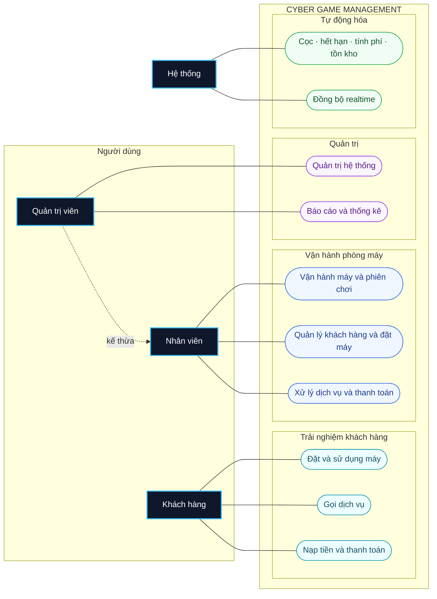
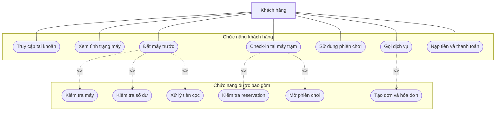
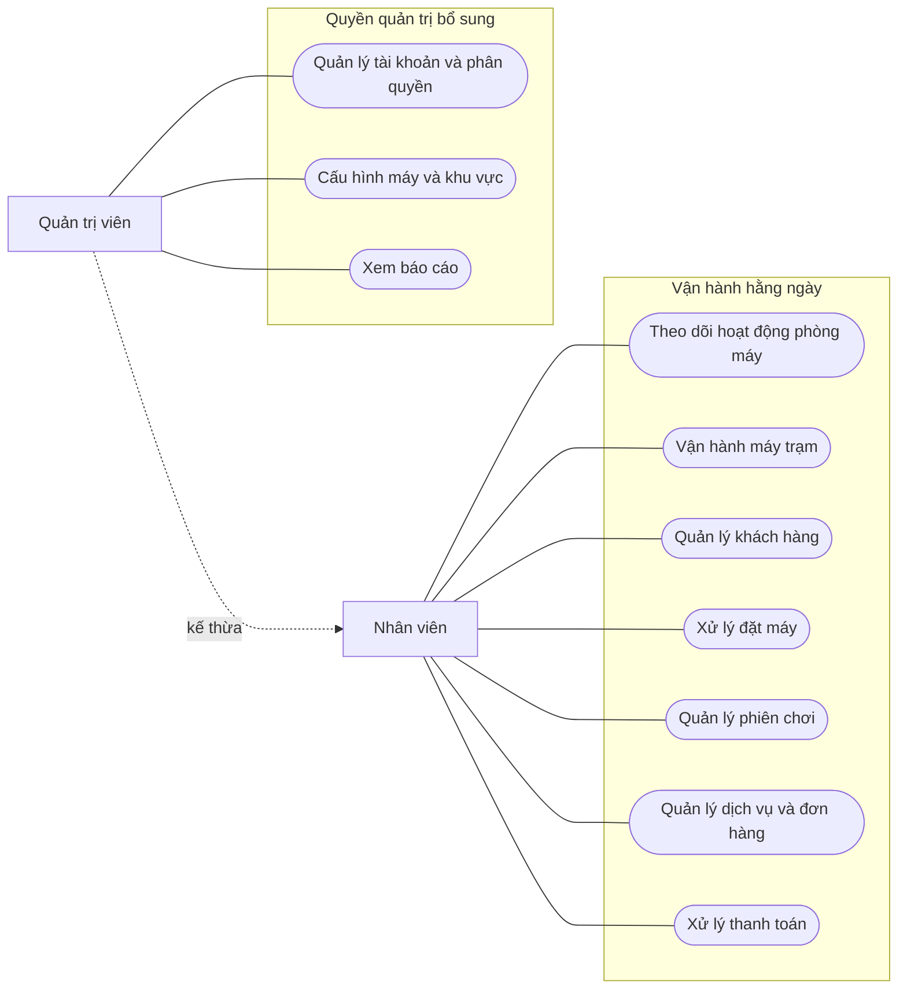
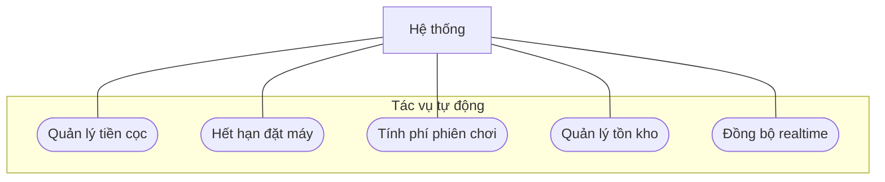

# Use Case Diagram

Actor **Khách hàng** bao gồm cả giai đoạn trước và sau đăng nhập. Sơ đồ đầu tiên là bản rút gọn nên dùng trên slide; các sơ đồ phía dưới dùng khi cần trình bày chi tiết.

## 1. Use Case tổng quan — dùng cho slide chính

Sơ đồ chính chỉ có 10 use case cấp cao. Các thao tác đăng nhập, kiểm tra số dư, tạo hóa đơn và cập nhật trạng thái được đặt bên trong luồng nghiệp vụ thay vì vẽ thành use case độc lập.

## 2. Chi tiết Khách hàng

## 3. Chi tiết Nhân viên và Quản trị viên

## 4. Chi tiết Hệ thống

## Phạm vi chức năng theo tác nhân

| Tác nhân | Chức năng tiêu biểu |
| --- | --- |
| Khách hàng | Đặt và sử dụng máy, gọi dịch vụ, nạp tiền và thanh toán |
| Nhân viên | Vận hành máy/phiên chơi, quản lý khách hàng/đặt máy, xử lý dịch vụ/thanh toán |
| Quản trị viên | Kế thừa Nhân viên, quản trị hệ thống và xem báo cáo |
| Hệ thống | Xử lý cọc, hết hạn reservation, tính phí, tồn kho và realtime |
