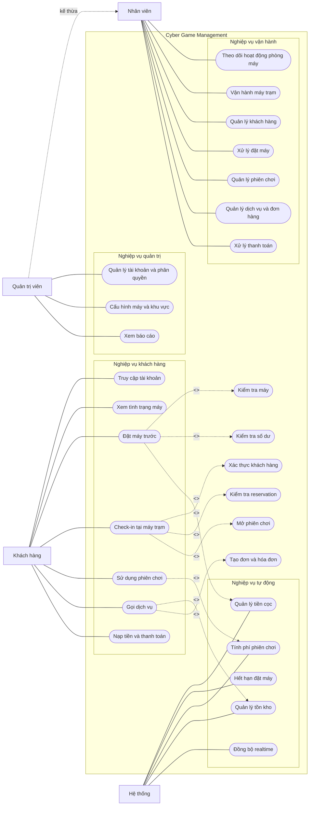

# Use Case Diagram tổng quan

Sơ đồ tập trung vào nghiệp vụ đặc trưng của Cyber Game. Actor **Khách hàng** bao gồm cả giai đoạn trước và sau đăng nhập.

## Phạm vi chức năng theo tác nhân

| Nhóm | Chức năng tiêu biểu |
| --- | --- |
| Khách hàng | Truy cập tài khoản, xem máy, đặt máy, check-in, chơi, gọi dịch vụ, nạp tiền và thanh toán |
| Nhân viên | Dashboard, vận hành máy, quản lý khách hàng, reservation, phiên chơi, dịch vụ và thanh toán |
| Quản trị viên | Kế thừa Nhân viên, thêm phân quyền, cấu hình máy/khu vực và báo cáo |
| Hệ thống | Tiền cọc, hết hạn reservation, tính phí, tồn kho và realtime |
