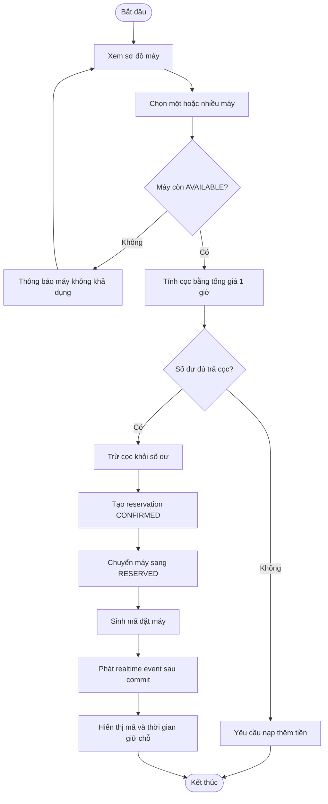
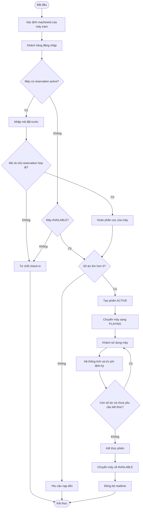
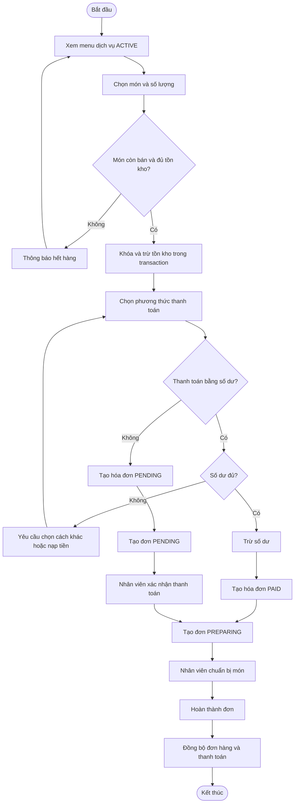
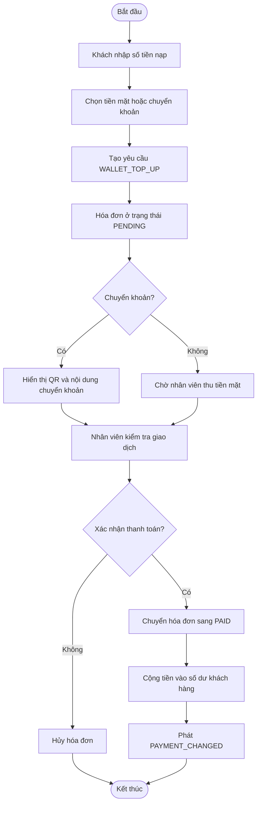

# Activity Diagram

## 1. Đặt máy trước

```mermaid
flowchart TD
    start(["Bắt đầu"]) --> browse["Xem sơ đồ máy"]
    browse --> select["Chọn một hoặc nhiều máy"]
    select --> checkMachine{"Máy còn AVAILABLE?"}
    checkMachine -- "Không" --> notifyUnavailable["Thông báo máy không khả dụng"] --> browse
    checkMachine -- "Có" --> calculate["Tính cọc bằng tổng giá 1 giờ"]
    calculate --> checkBalance{"Số dư đủ trả cọc?"}
    checkBalance -- "Không" --> notifyBalance["Yêu cầu nạp thêm tiền"] --> stop(["Kết thúc"])
    checkBalance -- "Có" --> debit["Trừ cọc khỏi số dư"]
    debit --> create["Tạo reservation CONFIRMED"]
    create --> hold["Chuyển máy sang RESERVED"]
    hold --> code["Sinh mã đặt máy"]
    code --> realtime["Phát realtime event sau commit"]
    realtime --> result["Hiển thị mã và thời gian giữ chỗ"]
    result --> stop
```

## 2. Check-in và chơi máy

```mermaid
flowchart TD
    start(["Bắt đầu"]) --> identify["Xác định machineId của máy trạm"]
    identify --> login["Khách hàng đăng nhập"]
    login --> reserved{"Máy có reservation active?"}
    reserved -- "Có" --> enterCode["Nhập mã đặt trước"]
    enterCode --> validCode{"Mã và chủ reservation hợp lệ?"}
    validCode -- "Không" --> reject["Từ chối check-in"] --> stop(["Kết thúc"])
    validCode -- "Có" --> refund["Hoàn phần cọc của máy"]
    reserved -- "Không" --> available{"Máy AVAILABLE?"}
    available -- "Không" --> reject
    available -- "Có" --> balance
    refund --> balance{"Số dư lớn hơn 0?"}
    balance -- "Không" --> topup["Yêu cầu nạp tiền"] --> stop
    balance -- "Có" --> session["Tạo phiên ACTIVE"]
    session --> playing["Chuyển máy sang PLAYING"]
    playing --> use["Khách sử dụng máy"]
    use --> charge["Hệ thống tính và trừ phí định kỳ"]
    charge --> enough{"Còn số dư và chưa yêu cầu kết thúc?"}
    enough -- "Có" --> use
    enough -- "Không" --> complete["Kết thúc phiên"]
    complete --> release["Chuyển máy về AVAILABLE"]
    release --> realtime["Đồng bộ realtime"] --> stop
```

## 3. Gọi dịch vụ

```mermaid
flowchart TD
    start(["Bắt đầu"]) --> menu["Xem menu dịch vụ ACTIVE"]
    menu --> select["Chọn món và số lượng"]
    select --> validate{"Món còn bán và đủ tồn kho?"}
    validate -- "Không" --> notify["Thông báo hết hàng"] --> menu
    validate -- "Có" --> stock["Khóa và trừ tồn kho trong transaction"]
    stock --> method["Chọn phương thức thanh toán"]
    method --> wallet{"Thanh toán bằng số dư?"}
    wallet -- "Có" --> balance{"Số dư đủ?"}
    balance -- "Không" --> reject["Yêu cầu chọn cách khác hoặc nạp tiền"] --> method
    balance -- "Có" --> debit["Trừ số dư"]
    wallet -- "Không" --> pending["Tạo hóa đơn PENDING"]
    debit --> paid["Tạo hóa đơn PAID"]
    pending --> order["Tạo đơn PENDING"]
    paid --> preparing["Tạo đơn PREPARING"]
    order --> confirm["Nhân viên xác nhận thanh toán"]
    confirm --> preparing
    preparing --> prepare["Nhân viên chuẩn bị món"]
    prepare --> complete["Hoàn thành đơn"]
    complete --> realtime["Đồng bộ đơn hàng và thanh toán"]
    realtime --> stop(["Kết thúc"])
```

## 4. Nạp tiền

```mermaid
flowchart TD
    start(["Bắt đầu"]) --> amount["Khách nhập số tiền nạp"]
    amount --> method["Chọn tiền mặt hoặc chuyển khoản"]
    method --> request["Tạo yêu cầu WALLET_TOP_UP"]
    request --> pending["Hóa đơn ở trạng thái PENDING"]
    pending --> transfer{"Chuyển khoản?"}
    transfer -- "Có" --> qr["Hiển thị QR và nội dung chuyển khoản"]
    transfer -- "Không" --> wait["Chờ nhân viên thu tiền mặt"]
    qr --> verify["Nhân viên kiểm tra giao dịch"]
    wait --> verify
    verify --> approved{"Xác nhận thanh toán?"}
    approved -- "Không" --> cancel["Hủy hóa đơn"] --> stop(["Kết thúc"])
    approved -- "Có" --> paid["Chuyển hóa đơn sang PAID"]
    paid --> credit["Cộng tiền vào số dư khách hàng"]
    credit --> realtime["Phát PAYMENT_CHANGED"]
    realtime --> stop
```
