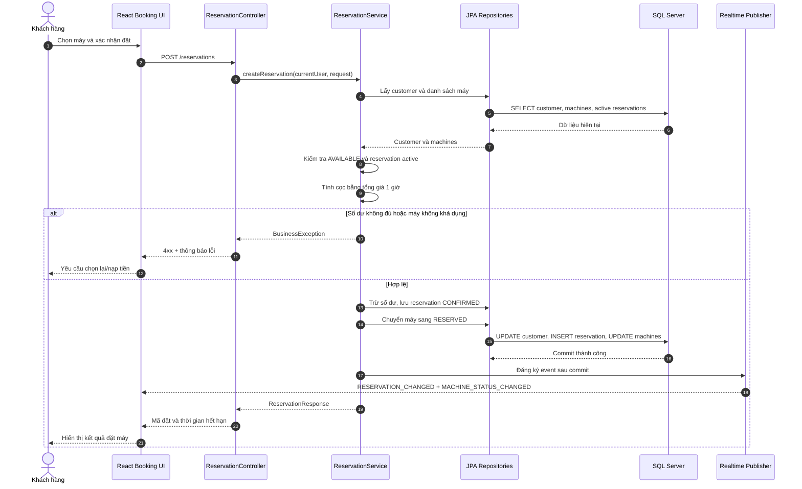
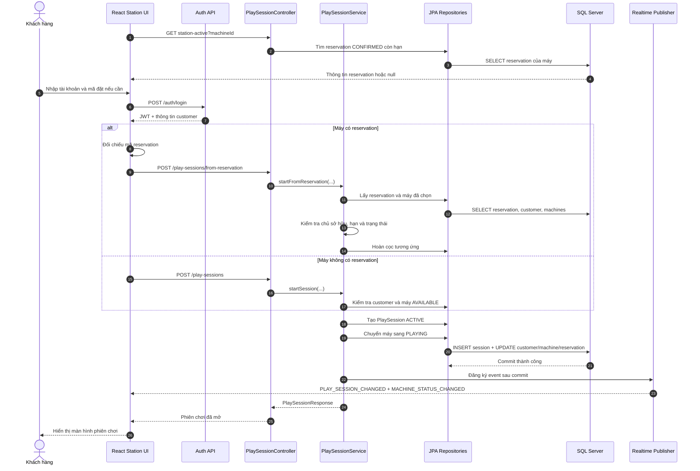
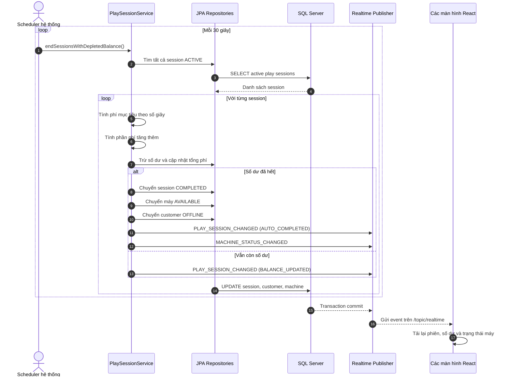
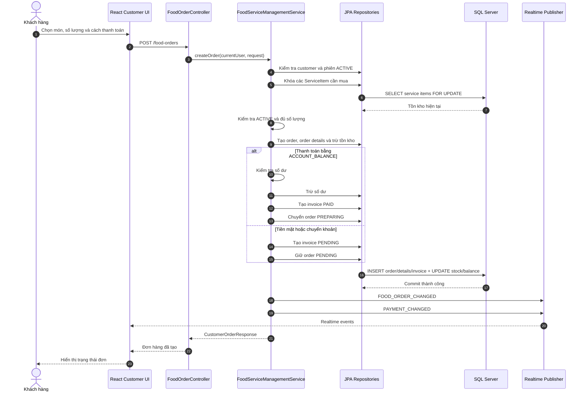

# Sequence Diagram

Các sequence dùng cùng kiến trúc: React UI → REST Controller → Transaction Service → Repository → SQL Server. Realtime event chỉ được gửi sau khi transaction commit thành công.

## 1. Khách hàng đặt máy

## 2. Check-in và mở phiên chơi

## 3. Hệ thống tự động trừ tiền phiên chơi

## 4. Khách hàng gọi món và thanh toán

