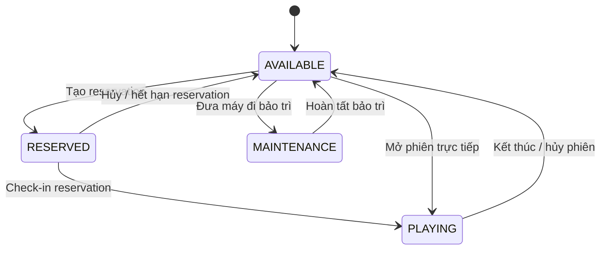
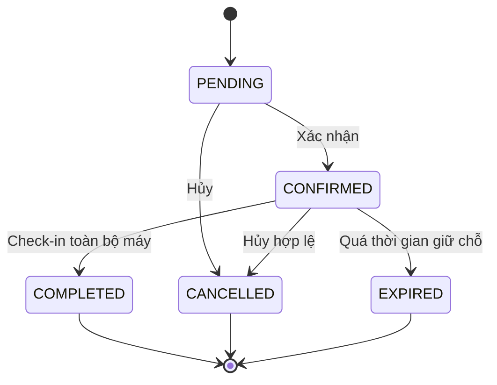
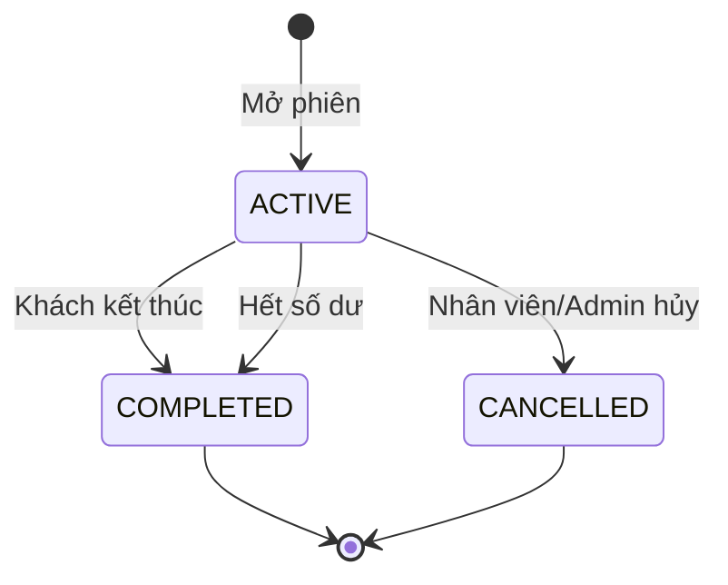
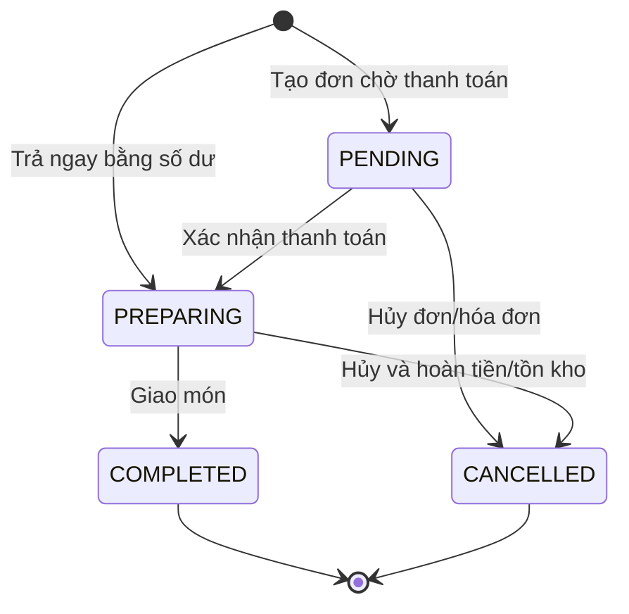
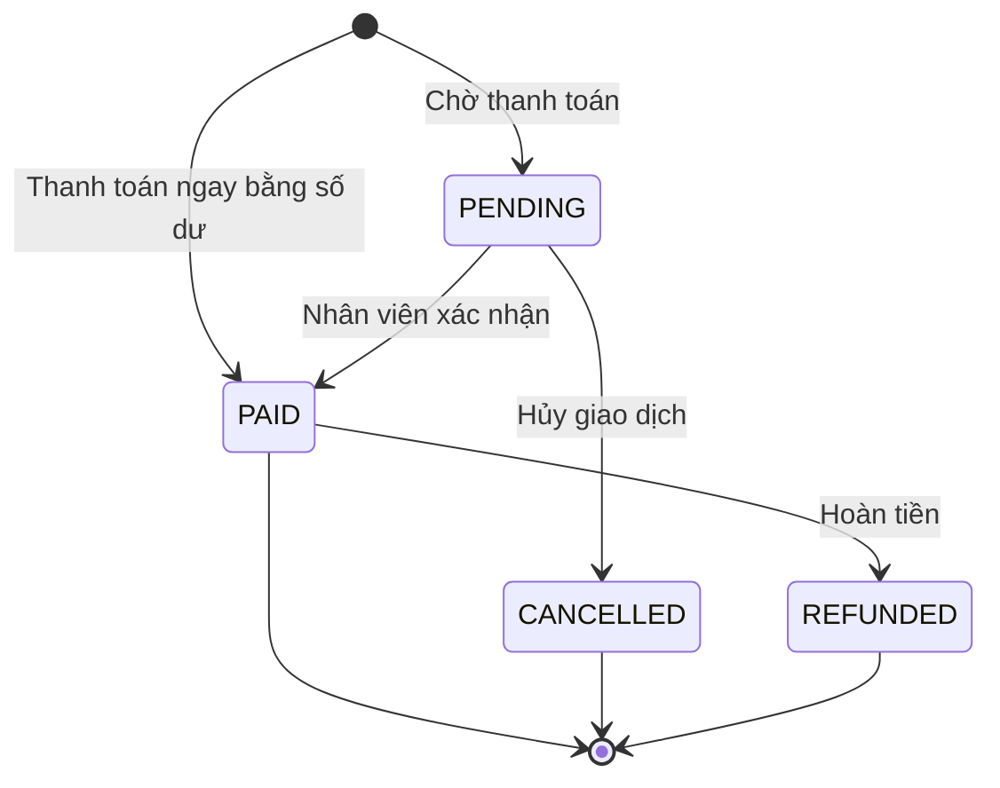

# State Diagram

## 1. Machine

## 2. Reservation

> Service hiện tạo reservation mới trực tiếp ở trạng thái `CONFIRMED`; `PENDING` vẫn tồn tại trong enum và luồng quản trị.

## 3. Play Session

## 4. Food Order

## 5. Invoice

