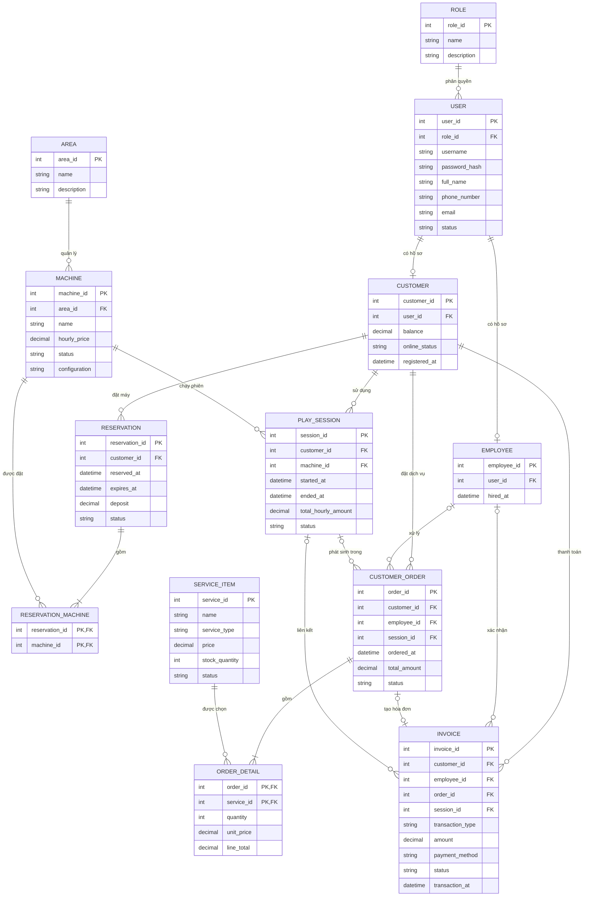

# Domain ERD

Sơ đồ chỉ giữ các entity cốt lõi trực tiếp tham gia các chức năng đang được trình bày. Các entity `Game`, `Membership`, `Promotion` và `MaintenanceHistory` không xuất hiện vì chưa có module nghiệp vụ hoàn chỉnh trên giao diện.

## Quan hệ nghiệp vụ chính

- Một user có một role và có thể có hồ sơ Customer hoặc Employee.
- Một khu vực chứa nhiều máy.
- Một reservation có thể giữ nhiều máy thông qua bảng nối.
- Mỗi play session thuộc một khách hàng và một máy.
- Một order gồm nhiều order detail; mỗi detail tham chiếu một service item.
- Invoice luôn thuộc một khách hàng và có thể liên kết order hoặc play session.
