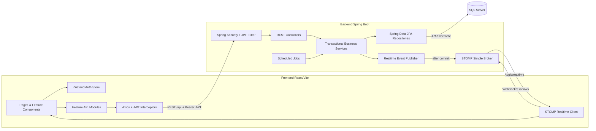
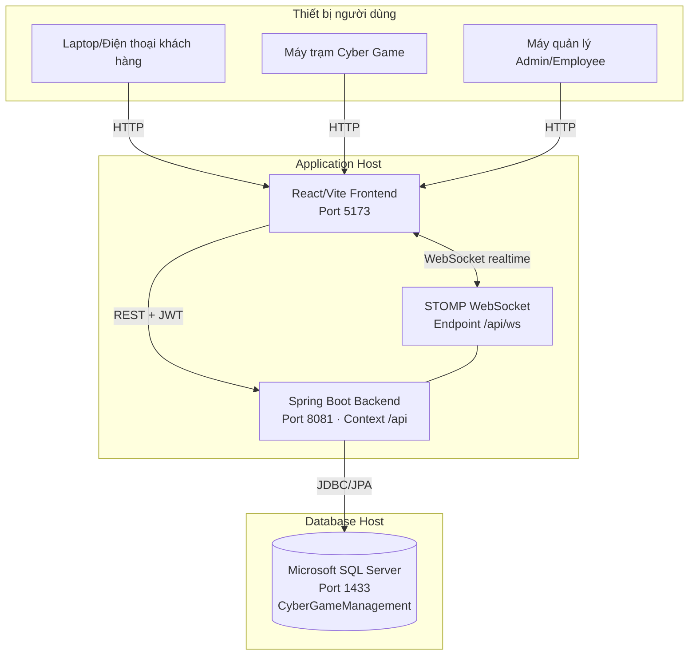

# Component và Deployment Diagram

## 1. Component Diagram

## 2. Deployment Diagram

## Giao thức và endpoint chính

| Kết nối | Giao thức | Địa chỉ local |
| --- | --- | --- |
| Browser → Frontend | HTTP | `http://localhost:5173/` |
| Frontend → Backend | REST/JSON + JWT | `http://localhost:8081/api` |
| Frontend ↔ Realtime | WebSocket/STOMP | `ws://localhost:8081/api/ws` |
| Backend → Database | JDBC | `localhost:1433/CyberGameManagement` |

## Luồng đồng bộ dữ liệu

1. UI gửi REST request kèm access token.
2. JWT filter xác thực và chuyển request vào controller.
3. Service thực hiện nghiệp vụ trong transaction và lưu qua repository.
4. Sau khi database commit, publisher gửi realtime event.
5. Frontend nhận event rồi tải lại dữ liệu REST liên quan.
